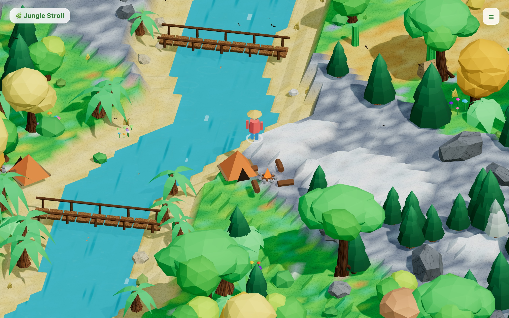
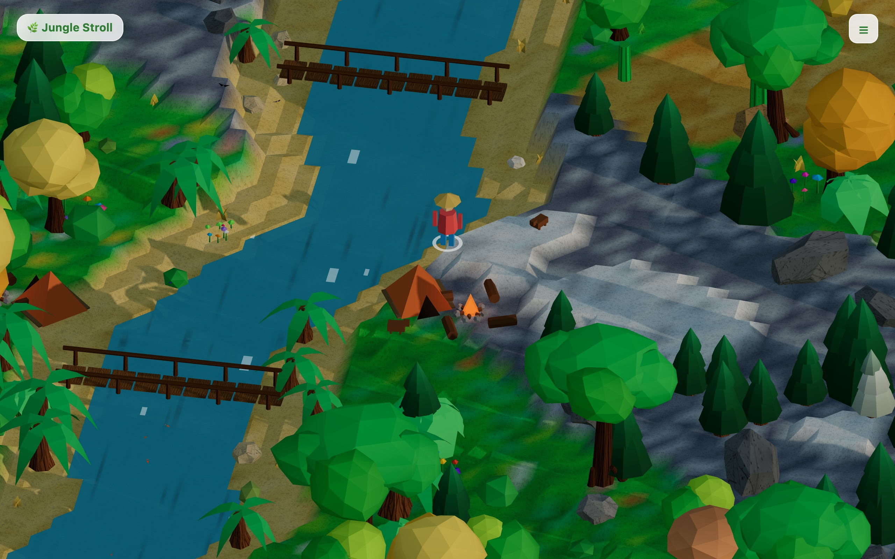
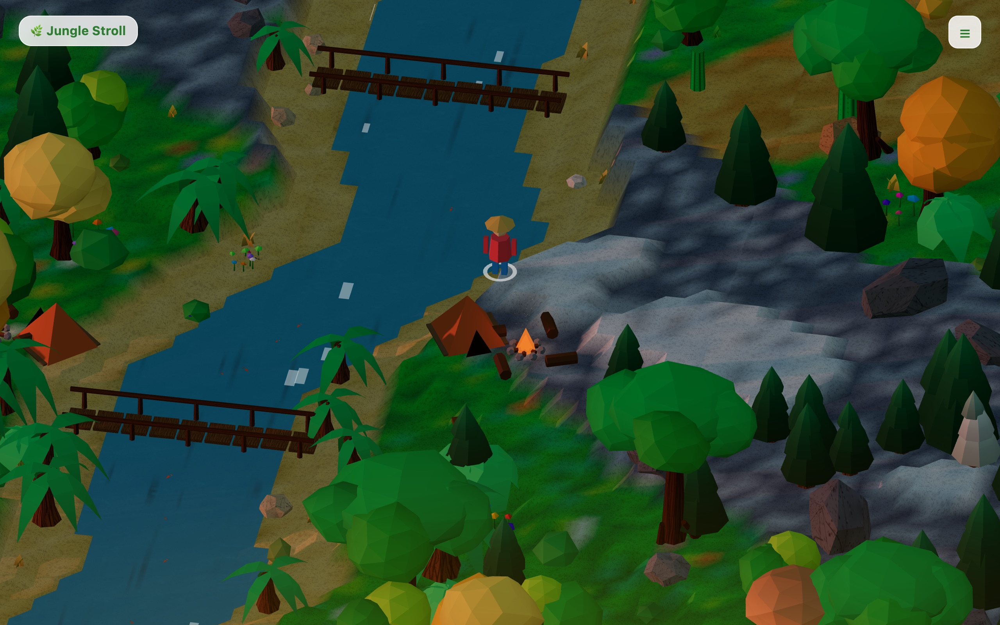
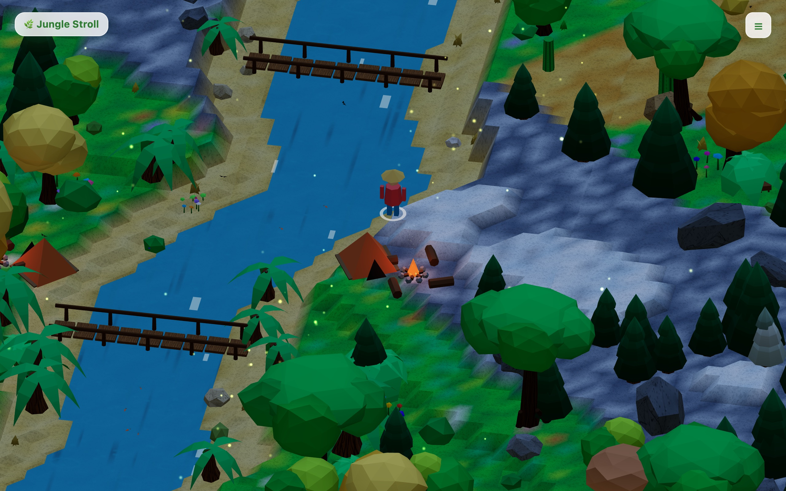
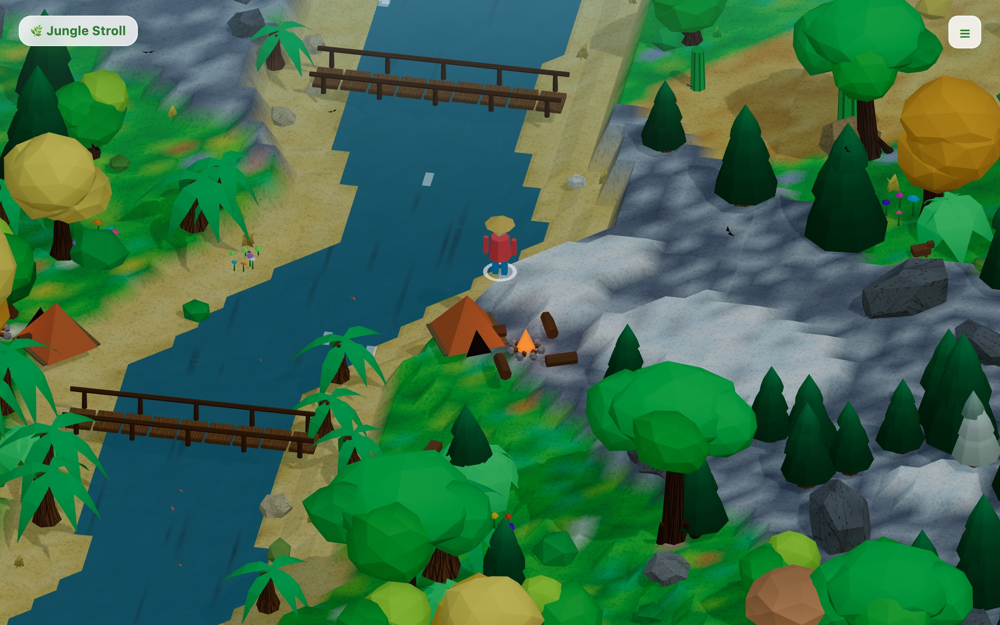
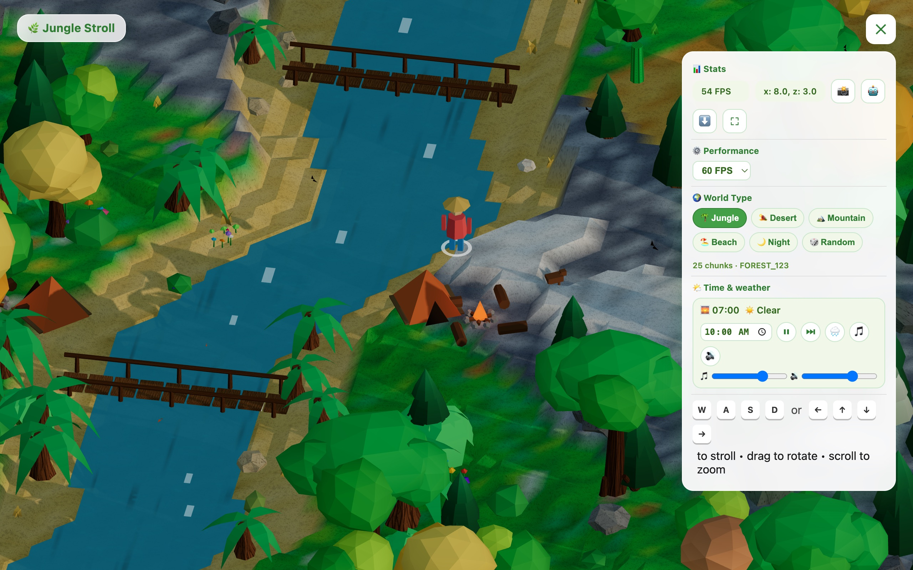

# 🌿 Jungle Stroll — Low Poly Isometric 3D

Stroll through an infinite low-poly / isometric 3D jungle built with **Three.js**. Procedural terrain, winding rivers, wooden bridges, campsites, day-night cycle, and dynamic weather — playable **offline** and installable as a mobile app (PWA).



> All screenshots below are captured live from the current build (`npm run dev`) via `window.__env` time/weather controls — 1280×800, default `FOREST_123` spawn near river + campsite.

## ✨ Features

- **Infinite procedural world** — seeded Simplex noise, stepped low-poly terrain, chunk streaming around the player (`src/world/chunks.js`, `procedural.js`, `noise.js`)
- **Biomes** — jungle, desert, mountain, snow, beach, river, each with its own vegetation and rocks (`presets.js`, `trees.js`, `rocks.js`)
- **Winding river + bridges** — carved water channel with foam, plus walkable wooden bridges (`river.js`, `bridge.js`)
- **Day-night cycle** — 10-minute game day, orbiting sun/moon, gradient skydome, stars, moon halo (`environment.js`)
- **Dynamic weather** — Clear / Overcast / Rain / Fog state machine with smooth ~6s crossfades, rain particles, wet surfaces
- **Night ambience** — fireflies, moonlight, glowing campfires with flicker + embers + smoke (`fireflies.js`, `campfire.js`)
- **Procedural audio & generative music** — multi-track cozy music box synthesized in real-time with 6 distinct procedural tracks configured via JSON instructions (`src/audio/cozy.js`, `music-tracks.json`), plus wind, rain, birds/crickets, and campfire crackle (WebAudio, zero audio assets)
- **Player character** — low-poly walker with swing animation, circle collision, river blocking (`entities/player.js`)
- **Seeded worlds** — share worlds via `?seed=FOREST_123`, dice button for a new world
- **Mobile ready** — floating joystick, swipe-to-rotate, pinch zoom, sprint button, adaptive resolution
- **PWA + offline** — Service Worker bundle cache, persistent storage, install prompt, fullscreen button (`core/pwa.js`, `core/bootCache.js`, `public/sw.js`)

| Sunrise (07:00) | Sunset glow (17:30) |
|---|---|
|  |  |

| Night campfire (00:00) | Rain storm |
|---|---|
|  |  |

## 🎮 Controls

| Input | Action |
|---|---|
| `W` `A` `S` `D` / Arrow keys | Stroll around |
| `Shift` | Sprint |
| `Drag mouse` | Rotate camera |
| `Scroll wheel` | Zoom |
| Left-half touch | Floating joystick to move |
| Right-half swipe | Rotate camera |
| Pinch | Zoom |
| 🏃 button | Sprint (touch) |
| `?seed=NAME` in URL | Load a specific world |

HUD extras: pause/resume time (⏸), jump morning/night (⏭), cycle weather (🌧️), toggle music / Shift-click to skip track (🎵), toggle ambient sound (🔇).

## 🌤️ Time & weather — try it live

All controls live in the **☰ menu → Time & weather** panel (see screenshot). The game runs a 10-minute day (`ENV.dayLengthSec = 600` in `src/config.js`, starts at `10:00`) with auto weather re-roll every ~75s and ~6s crossfades.



**Via UI (no code):**
- Time picker → jump to any hour (e.g. `06:00` sunrise, `17:30` sunset, `00:00` night)
- ⏸ pause / resume the day cycle, ⏭ jump morning ↔ evening
- 🌧️ button cycles `Clear → Overcast → Rain → Fog`
- 🎵 / 🔊 sliders for music vs ambient volume
- 🌍 World Type buttons: Jungle / Desert / Mountain / Beach / Night (midnight start) / Random

**Via devtools console (for exact screenshots / demos):**
```js
// Freeze time so lighting is deterministic
__env.state.paused = true; __env.state.weatherTimer = 9999;

// Time presets used for the screenshots above
__env.setTime(10);   // day
__env.setTime(7);    // sunrise
__env.setTime(17.5); // sunset
__env.setTime(0);    // night + campfire + fireflies

// Weather presets (allow ~2s for the ~6s crossfade + rain fade-in)
__env.setWeather('clear');
__env.setWeather('overcast');
__env.setWeather('rain');
__env.setWeather('fog');
```

**Via config (`src/config.js` → `ENV`):**
```js
export const ENV = {
  dayLengthSec: 600,      // 1 game day = 10 real minutes
  startTime: 10.0,        // 10:00 morning spawn
  weatherIntervalSec: 75, // auto re-roll interval
};
```

Vegetation can be tuned in the same file via `VEGETATION`: `treeDensity` is a
multiplier for tree placement (default `0.65`) and `treeScale` controls tree
size (default `0.9`). Use `1` for the original density/size, or lower values
for a more open, park-like world.

## 🚀 Quickstart

```bash
npm install
npm run dev      # http://localhost:5173
npm run build    # outputs to dist/
npm run preview  # preview the production build
```

No backend needed — it's a static Vite + Three.js site.

## 🗂 Project structure

```
index.html                  # HUD, joystick, touch UI, loading screen
src/
  main.js                   # boot, game loop, movement, HUD
  config.js                 # tuning constants (speed, seeds, fog, camera)
  style.css                 # HUD / joystick / loading styles
  audio/
    cozy.js                 # generative music box engine (WebAudio synth)
    music-tracks.json       # instructions for 6 procedural music tracks
  core/
    setup.js                # renderer, iso camera, lights, quality tiers
    bootCache.js            # pre-game SW + texture/GPU warm-up pipeline
    pwa.js                  # fullscreen + install buttons
  input/controls.js         # keyboard, joystick, look, pinch, zoom
  entities/player.js        # low-poly walker
  world/
    procedural.js / noise.js# seeded noise, biomes, ground height, river path
    chunks.js               # infinite chunk streaming + instanced vegetation
    ground.js / textures.js # terrain material + procedural canvas textures
    trees.js / rocks.js / presets.js  # vegetation kits
    river.js / bridge.js    # water + wooden bridges
    clouds.js               # drifting low-poly clouds
    environment.js          # day-night, weather, skydome, rain, audio
    fireflies.js / campfire.js  # night FX + campsites
public/
  manifest.webmanifest      # PWA manifest
  sw.js                     # Service Worker bundle cache
  icons/ / favicon.svg
docs/
  screenshots/              # game captures used in this README
  weather-day-night-cycles.md
  enhance_for_night_screen.md
  generate_random_words.md  # procedural-generation design notes
  procedural-music.md       # procedural generative music design & JSON specs
```

## 📖 Design docs

- [Day-night cycle & weather](docs/weather-day-night-cycles.md)
- [Night ambience: fireflies, moon, clouds, campfires](docs/enhance_for_night_screen.md)
- [Procedural random worlds](docs/generate_random_words.md)
- [Procedural generative music engine](docs/procedural-music.md)

## 📱 PWA / offline notes

- The bundle (`js`/`css`/`html`) is built once with `npm run build` and is identical for all devices.
- Each browser/device keeps its own copy in Cache Storage after the first visit — no per-device server build step.
- Bumping `version` in `package.json` ships a new Service Worker cache (`jungle-v<version>`).

## 🛠 Tech

- [Three.js](https://threejs.org/) `^0.170.0`
- [Vite](https://vitejs.dev/) `^6.0.0`
- Plain JS + WebAudio, zero image/audio assets — all textures and sounds are procedural.
